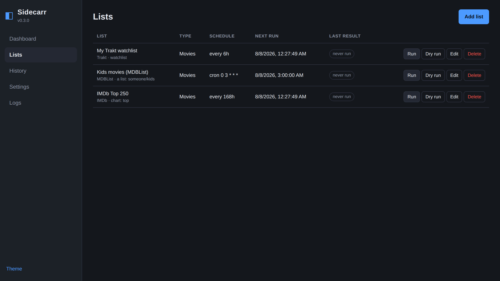
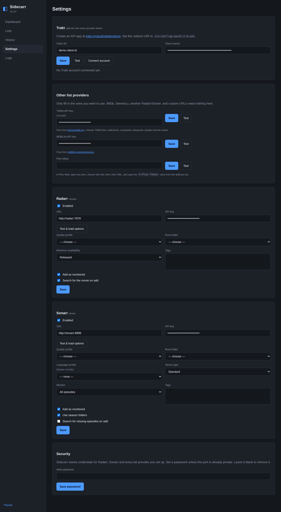
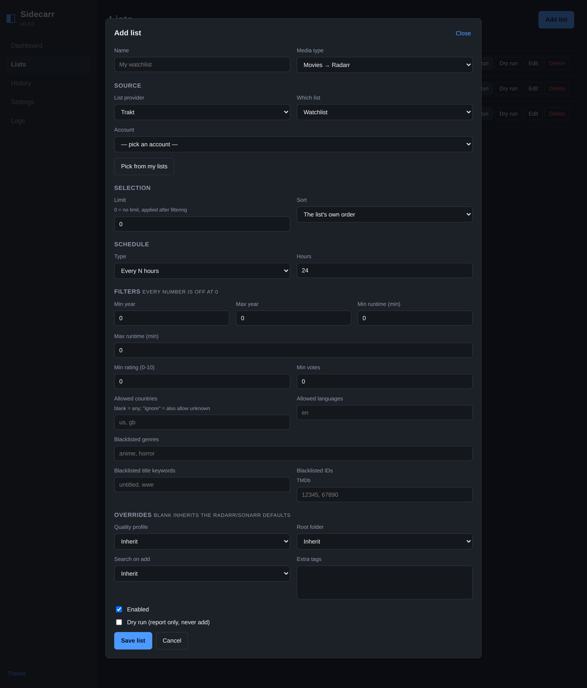
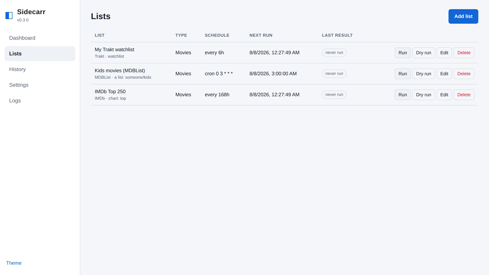

<h1 align="center">Sidecarr</h1>

<p align="center">
  Sync lists from Trakt, TMDb, MDBList, IMDb, Plex and anywhere else
  into Radarr and Sonarr — from a browser, in Docker.
</p>

<p align="center">
  <a href="https://github.com/austinmabry/sidecarr/actions/workflows/ci.yml"></a>
  <a href="https://github.com/austinmabry/sidecarr/releases"></a>
  <a href="https://github.com/austinmabry/sidecarr/pkgs/container/sidecarr"></a>
  <a href="LICENSE"></a>
</p>



Point Sidecarr at the lists you already keep — wherever you keep them — and it
adds what is missing to Radarr or Sonarr on a schedule. It never removes,
unmonitors or modifies anything you already have.

- **Eight list providers.** Trakt, TMDb, MDBList, IMDb, Plex, StevenLu, another
  Radarr/Sonarr instance, or any URL that returns a list.
- **Configured entirely in the browser.** No config file to hand-edit, no CLI to
  cron. Port 9898.
- **Per-list filters and schedules.** Year, runtime, rating, votes, genres,
  countries, languages, networks, title keywords. Every list on its own interval
  or cron.
- **Dry run.** Walks the whole pipeline and reports exactly what it would do,
  without writing anything.
- **Honest history.** Every title gets a recorded outcome and a reason — added,
  already present, filtered, excluded or failed.
- **Add-only by design.** No delete, no unmonitor, no library cleaning.
- **Bulk import.** Titles go over in batches, not one request each, so a big
  first sync does not hammer Radarr's metadata service.
- **Credentials encrypted at rest**, with CSRF protection and a strict
  Content-Security-Policy on the web UI.
- **Light and dark themes**, following your system by default.
- **Multi-arch.** `linux/amd64` and `linux/arm64`, so it runs on a NAS or a Pi.

## Quick start

```yaml
services:
  sidecarr:
    image: ghcr.io/austinmabry/sidecarr:latest
    container_name: sidecarr
    restart: unless-stopped
    ports:
      - "9898:9898"
    volumes:
      - ./config:/config
    environment:
      - TZ=Etc/UTC
```

```bash
docker compose up -d
```

Open <http://localhost:9898> and work through Settings top to bottom.

<details>
<summary><strong>Unraid</strong></summary>

Unraid's appdata is owned by `nobody:users`, and the image defaults to uid 1000,
so set the user explicitly:

```bash
mkdir -p /mnt/user/appdata/sidecarr
chown -R 99:100 /mnt/user/appdata/sidecarr

docker run -d \
  --name sidecarr \
  --restart unless-stopped \
  --user 99:100 \
  -p 9898:9898 \
  -v /mnt/user/appdata/sidecarr:/config \
  -e TZ=America/Chicago \
  ghcr.io/austinmabry/sidecarr:latest
```

With the Compose Manager plugin, put the same settings in a
`docker-compose.yml` under
`/boot/config/plugins/compose.manager/projects/sidecarr/`, adding
`user: "99:100"`.

Address Radarr and Sonarr by the server's IP (`http://<UNRAID-IP>:7878`).
Unraid's default bridge network has no container-name DNS, and `localhost`
inside the container is the container itself.
</details>

<details>
<summary><strong>Alongside an existing media stack</strong></summary>

Put Sidecarr on the same network and address the other containers by name:

```yaml
services:
  sidecarr:
    image: ghcr.io/austinmabry/sidecarr:latest
    container_name: sidecarr
    restart: unless-stopped
    ports:
      - "9898:9898"
    volumes:
      - ./config:/config
    environment:
      - TZ=Etc/UTC
    networks: [media]

networks:
  media:
    external: true
```

Then use `http://radarr:7878` and `http://sonarr:8989`.
</details>

> **Inside a container, `localhost` means that container.** Use the service name
> on a shared Docker network, or the host's LAN IP — never
> `http://localhost:7878`.

## Providers

Every provider is optional and independent. Use the one service you already keep
lists in and ignore the rest.

| Provider | Needs | Lists it can pull |
| --- | --- | --- |
| **Trakt** | Client ID + secret; an account for private lists | Watchlist, custom list, collection, personal recommendations, trending, popular, anticipated, box office, most watched/played, by person |
| **TMDb** | A free API key | Custom list, collection, company, keyword, person, popular, top rated, trending, upcoming, now playing, on the air, airing today |
| **MDBList** | A free API key | Any list by URL/slug/ID, your own lists, your watchlist, the public top lists |
| **IMDb** | Nothing | Any public `ls…` list, plus the Top 250, Most Popular, Top English and box office charts |
| **Plex** | A Plex token | Your Plex Discover watchlist |
| **StevenLu** | Nothing | The published popular-movies list (movies only) |
| **Another Radarr / Sonarr** | Its URL + API key | Mirror a second instance's library |
| **Custom list** | Nothing | Any URL returning JSON, RSS/Atom, or a list of IDs |

### Custom lists

The custom provider is deliberately forgiving, because "a URL that returns a
list" has no single format. It understands:

- Sonarr's custom-list JSON — `[{"title": …, "tvdbId": 1, "tmdbId": 2, "imdbId": "tt3"}]`
- Radarr's and StevenLu's — `[{"title": …, "imdb_id": "tt3"}]`
- MDBList's — `{"movies": [...], "shows": [...]}`
- Wrapped arrays under `items`, `results`, `entries` or `data`
- RSS and Atom feeds, taking IMDb IDs from the link, guid or description
- A bare list of IDs — `[603, 604]`, `["tt0133093"]`, or newline/comma separated

Each entry needs only one of a TMDb, TVDb or IMDb ID; Sidecarr resolves the rest.

### Not included

**Simkl, AniList and MyAnimeList.** Radarr and Sonarr reach all three through
`auth.servarr.com`, an OAuth proxy using the Servarr project's own registered
application credentials. Those are not Sidecarr's to use, and supporting these
properly means registering separate OAuth applications with each service.
Contributions welcome — the provider interface is the easy part.

**CouchPotato.** The project has been dead for years.

## Setup

### 1. A list provider

Set up whichever you actually use. IMDb, StevenLu, another Radarr/Sonarr and
custom URLs need no credentials at all, so this step is often skippable.

| Provider | Where to get it |
| --- | --- |
| Trakt | Create an app at [trakt.tv/oauth/applications](https://trakt.tv/oauth/applications) with the redirect URI `urn:ietf:wg:oauth:2.0:oob`. Save the client ID and secret, then **Connect account** and enter the 8-character code at trakt.tv/activate. |
| TMDb | A free v3 API key from [themoviedb.org](https://www.themoviedb.org/settings/api). |
| MDBList | A free API key from [mdblist.com/preferences](https://mdblist.com/preferences/). |
| Plex | In Plex Web, open any item → Get Info → View XML, and copy `X-Plex-Token` from the address bar. |

A Trakt account is only needed for your own watchlist, collection and
recommendations, and for private lists. Each provider has a **Test** button that
saves what is in the box and then checks it.



### 2. Radarr and Sonarr

Paste the URL and API key (Radarr/Sonarr → Settings → General → API Key), press
**Test & load options**, then pick a quality profile and root folder from the
dropdowns Sidecarr just fetched.

Sonarr v3 has language profiles and v4 does not. Sidecarr detects which you are
running and hides the field when it does not apply.

### 3. Add a list

Lists → **Add list**. Pick the media type, choose a provider and one of its
lists, set a schedule, and save. The form rebuilds itself for whichever provider
you pick, and only offers combinations that can work — Trakt's box office
disappears when the list targets shows, StevenLu disappears entirely.

For Trakt and MDBList, **Pick from my lists** browses the lists you own and have
liked, so there are no URLs to paste.



The whole UI has a light theme too, switchable from the sidebar and following
your system by default.



**Use Dry run first.** It walks the whole pipeline and records exactly what it
would add, without writing anything. It also resolves every candidate, so a
title Radarr has no metadata for is reported up front rather than promised and
then failed on the real run.

## What Sidecarr will and will not do

It makes exactly two kinds of write request, ever: `POST /api/v3/movie` and
`POST /api/v3/series`. There is no `DELETE`, `PUT` or `PATCH` anywhere in the
codebase, and no code path that can remove, unmonitor, rename or modify anything
already in your library.

This is deliberately narrower than Radarr's own import lists, whose
`CleanLibraryLevel` setting includes removing a movie and deleting its files
when it falls off a list. Sidecarr has no equivalent.

Before adding anything it reads your whole library and skips what you already
have, matching on both TMDb/TVDb and IMDb IDs. A list of 100 where you own 90
adds 10. It also respects Radarr's and Sonarr's exclusion lists.

**Adding a movie triggers a search by default.** Radarr's `search_on_add`
defaults to on, so it will start grabbing immediately; Sonarr's defaults to off.
Both are toggles in Settings. Turn Radarr's off to add titles as monitored but
missing, and untick **Add as monitored** as well if you want entries that do
nothing until you say so.

## Matching IDs across providers

Radarr identifies movies by TMDb ID and Sonarr identifies series by TVDb ID, but
most providers hand out something else — MDBList and IMDb lead with IMDb IDs,
and TMDb has no TVDb ID for shows. Sidecarr closes the gap in three steps:

1. Use the ID the provider gave, if it is already the right one.
2. Ask the provider — TMDb, for instance, can turn its own show ID into a TVDb one.
3. Ask Radarr or Sonarr, whose own search already knows the cross-mappings.

Step 3 means an IMDb-only list works with no extra API key at all. Resolution is
lazy, running only for titles that survive filtering and are about to be added,
so a long list does not cost a lookup per entry. Anything unresolvable is
recorded in History rather than silently vanishing.

## Filters

Every filter is per-list, and every numeric filter is **off at 0**.

| Filter | Effect |
| --- | --- |
| Min / max year | Release year, or first-aired year for shows |
| Min / max runtime | Minutes |
| Min rating, min votes | The provider's own numbers |
| Allowed countries / languages | Blank = anything. A list = only those. `ignore` = anything, including titles missing the field |
| Blacklisted genres | Genre slugs, e.g. `anime`, `horror` |
| Blacklisted networks | Shows only, substring match |
| Blacklisted title keywords | Substring match |
| Blacklisted IDs | TMDb for movies, TVDb for shows |

`Limit` applies **after** filtering, so 10 means ten titles that passed, not ten
candidates that might not. `Sort` runs before the limit, so limit + sort by votes
gives the ten most-voted eligible titles.

A filter can only judge metadata the provider actually sent, and providers differ
enormously. Trakt and TMDb are rich; an IMDb list or a bare custom URL may give
little more than an ID. Filtering an IMDb list by year or genre therefore rejects
everything — the reason recorded in History names the provider
(`no release year from IMDb`) so this is visible rather than mysterious. Use the
limit instead, or pull the same list through MDBList, which does return metadata.
TMDb's list endpoints carry no runtime, so runtime filters have nothing to judge
there either.

### Coming from traktarr

Sidecarr carries [traktarr](https://github.com/l3uddz/traktarr)'s filtering model
over almost field for field, with two deliberate changes:

- **Defaults are permissive.** traktarr shipped `min_year: 2000` /
  `max_year: 2019` and quietly dropped everything else. Sidecarr filters nothing
  until asked.
- **Countries and languages match exactly.** traktarr used a substring
  comparison, so `us` also matched `rus`.

traktarr itself has been unmaintained since June 2022 and pins
`attrdict==2.0.0`, which cannot run on Python 3.10 or newer.

## Scheduling

Per list: every N hours, a cron expression, or manual only. Interval schedules
resume from the last successful run rather than restarting the clock, so
restarting the container does not push the next sync out a full day. A list still
syncing when its next run comes due skips that tick instead of stacking.

## Configuration

Everything lives in `/config`, which should be a mounted volume:

- `config.json` — settings, lists and Trakt tokens, written `0600`
- `sidecarr.db` — run history, last 200 runs

API keys and OAuth tokens inside `config.json` are encrypted. By default the key
is generated into `/config/secret.key` (mode 0600), which protects a stray copy
of `config.json` but not a copy of the whole volume — the key is sitting next to
it. Set `SIDECARR_SECRET_KEY` to a passphrase to keep the key off the volume
entirely, which is the stronger arrangement. Back up `secret.key` alongside the
config, or the stored credentials cannot be read back.

### Environment variables

| Variable | Default | Purpose |
| --- | --- | --- |
| `TZ` | UTC | Timezone for cron schedules and log timestamps |
| `SIDECARR_PORT` | `9898` | Listen port |
| `SIDECARR_LOG_LEVEL` | `INFO` | `DEBUG` logs every per-title filter decision |
| `SIDECARR_PASSWORD` | unset | Seeds the web password on first boot only |
| `SIDECARR_SECRET_KEY` | unset | Passphrase for encrypting stored credentials. Keeps the key off the config volume |
| `SIDECARR_COOKIE_SECURE` | `false` | Set `true` when served over HTTPS |
| `SIDECARR_CONFIG_DIR` | `/config` | Config and database location |
| `SIDECARR_MAX_TRAKT_PAGES` | `20` | Page cap per sync (100 items per page) |
| `SIDECARR_ADD_DELAY` | `0.5` | Seconds between batches of adds |
| `SIDECARR_BULK_BATCH_SIZE` | `50` | Titles per bulk import request |

### Upgrading from Plextra

This project was called Plextra through 0.2.0. Nothing needs to be done by hand:

- `PLEXTRA_*` variables are still read, so an unchanged compose file keeps
  working. Sidecarr logs a deprecation warning naming each one it fell back to.
  `PLEXTRA_SECRET_KEY` matters most — if it stopped being read, stored
  credentials would no longer decrypt.
- `plextra.db` is renamed to `sidecarr.db` on first start, so run history
  survives.
- The image moved to `ghcr.io/austinmabry/sidecarr`. Point the container at the
  new image and keep the same `/config` volume.

Rename the variables to `SIDECARR_*` when convenient; the fallback will be
removed in a later release.

### Security

Sidecarr holds credentials for several services, so set a password in
Settings → Security unless the port is genuinely private. It warns in the log on
every boot until you do. `/api/health` stays open for Docker's healthcheck;
everything else requires the session cookie.

Beyond that: stored credentials are encrypted at rest, every mutating request
needs a CSRF token, and responses carry a Content-Security-Policy that permits
no inline or remote script, plus `X-Frame-Options`, `X-Content-Type-Options`,
`Referrer-Policy` and `Cross-Origin-Opener-Policy`.

Set `SIDECARR_COOKIE_SECURE=true` behind an HTTPS reverse proxy.

Scripted clients must read the `sidecarr_csrf` cookie from any GET and send it
back in an `X-CSRF-Token` header:

```bash
TOKEN=$(curl -s -c /tmp/jar http://localhost:9898/api/health >/dev/null && awk '/sidecarr_csrf/{print $7}' /tmp/jar)
curl -b /tmp/jar -H "X-CSRF-Token: $TOKEN" -X POST http://localhost:9898/api/lists/<id>/run
```

## Troubleshooting

**Nothing gets added, but nothing errors.** Check History. Every title has a
recorded outcome and reason — usually `already in library` or a filter.

**"Trakt account is not authorised".** The source needs a connected account.
Settings → Trakt → Connect account, then pick it in the list editor.

**Connection refused to Radarr/Sonarr.** `localhost` inside a container is the
container. Use the service name on a shared Docker network, or the host's LAN IP.

**"Radarr returned HTTP 500 … metadata service".** Radarr proxies metadata
through `api.radarr.video`, which answers a title it does not have with a clean
**404**. A **500 therefore does not mean the title is missing** — it means that
service, or the network path to it, failed. It is transient. Do nothing: the
next sync retries and usually succeeds, and the title should *not* be
blacklisted. If it hits several titles in one burst then stops, the likely cause
is rate limiting, since every add makes Radarr fetch metadata — set a **limit**
on the list to spread the work across runs.

**"Radarr does not recognise TMDb …".** This is the genuine miss, a clean 404.
Radarr's own Add Movie search will not find it either, so there is nothing to be
done — usually a TMDb entry deleted or merged after the list was built. Add the
ID to the list's blacklisted IDs to stop it being retried.

**"Path '…' is already configured for an existing movie".** The film is already
in the library under a different TMDb ID. Sidecarr matches on IMDb ID as well and
reports these as `already in library, under a different ID` before attempting an
add, so this should not reach Radarr. If it still does, the existing entry has no
IMDb ID recorded.

**`docker compose pull` says denied.** Check the Release workflow run: if
**Build and publish** is green the image exists and the package is simply
private. If that job was *skipped*, the tests before it failed and blocked the
publish.

**Cron never fires.** Set `TZ`. Cron is evaluated in the container's timezone,
which is UTC unless you say otherwise. An invalid expression is logged at startup
and the list is not scheduled.

## Changelog

See [CHANGELOG.md](CHANGELOG.md).

## Contributing

Bug reports, provider requests and pull requests are welcome. See
[CONTRIBUTING.md](CONTRIBUTING.md) for the development setup, how the code fits
together, and a walkthrough of adding a provider — which needs no front-end work,
because the web UI renders the list editor from each provider's own description.

## License

[MIT](LICENSE)
